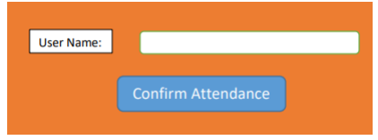
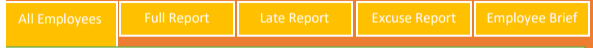

# CST-Project Intake43

> Hi all, this is the repo that holds the project assessment that covers all client side technologies courses HTML, CSS, bootstrap, javascript, jQuery, Advanced JS, and ECMA NEXT.

---

## Assessment

1. Create attendance system using the following technologies:
   - Client side technologies (CSS, HTML, JS)
   - Html5 and CSS3.0
   - Advanced JS and ECMA Next
   - (JQuery, Ajax, fetch)
   - RWD
   - Any Web API Can help in your work.
2. Storing and saving your reports data in JSON formats using JsonServer.
3. make sure you make all validations and user restriction on data before saving.
    - NB:
       - Follow clean coding practices (naming of variables and methods, …)
       - Project is individual
       - You have to create folder for every type of data: ex: for scripts create script
  folder, and another one for styles, …

## Details:
1. There are two users for that system:
   - Admin
   - Employee (security man or Employee)
2. System Pages:
   - Home Page
   - Profile Page
   - Attendance Page

3. Implement the frontend code to make it work with the following functionalities:
   - [ ] new employees must register his / her data to be able to log in next time.
   - [ ] no Registration Allowed for duplicate emails.
   - [ ] After registration, an e-mail will be sent to employee email. holding a
     unique username (Random Code) and a password (search for how to send Email using js). The employee can log in the system using those two fields after admin confirmation.
   - [ ] The Attendance page will be viewed to the employee who is responsible for the attendance system.
        

          
        
  
   - [ ] If the same username entered another time, the system will register
     departure for employee not attendance again.
   - [ ] If the employee attended, he can register departure any time he wants or
     the system will register departure for his / her after 7 working hours started
     from 8:30 Am to 3:30PM.
   - [ ] The Employee Can Show the following reports: Daily and monthly reports. You can any other reports for employee Role
     

         
     
  
   - [ ] Admin Reports: All employees, full report, Excuse report, late report, and employee brief.

     

        
     

5. Feel free to enhance the APIs to suit your needs if needed.
6. Try to use JQ Dashboard Widget to display Admin Reports (example: https://www.bootstrapdash.com/jquery-dashboard-example/ )
